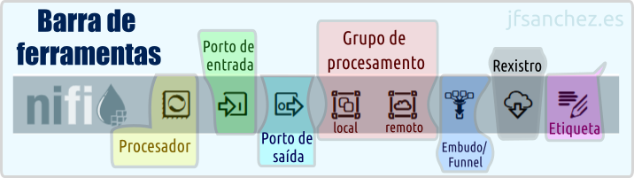

# 💧 Apache Nifi &mdash; 🐜️ Conceptos previos

Apache Nifi é un software adicado a automatizar o fluxo de datos entre sistemas. Tamén pode ser considerado unha ferramenta **ETL** (**E**xtract/**T**ransform/**L**oad), xa que permite extraer datos de orixes diversas, transformalos e cargalos no seu destino final, todo isto mediante unha interface visual baseada en fluxos (*dataflows*). Web Oficial: <https://nifi.apache.org/>

## Barra de ferramentas de Apache Nifi

A seguinte documentación foi elaborada empregando a versión: **2.2.0**.

Dende esta barra, situada na parte superior do canvas, pódense arrastrar ao lenzo os elementos básicos cos que se constrúe un fluxo de datos:

- **Processor**: o compoñente principal, encargado de realizar unha tarefa concreta (ler, transformar, enviar datos...).
- **Input Port / Output Port**: portos de entrada e saída, usados para comunicar grupos de procesamento entre si.
- **Process Group**: agrupa un conxunto de procesadores e conexións baixo unha mesma unidade lóxica.
- **Remote Process Group**: permite conectar con outra instancia de Nifi (ou clúster) mediante Site-to-Site.
- **Funnel**: combina varias conexións de entrada nunha soa saída.
- **Template** *(en desuso a partir da versión 2.x, substituído polo Nifi Registry e os *flow definitions*)*.
- **Label**: etiqueta de texto para documentar visualmente o canvas, sen afectar á execución do fluxo.

## Procesadores

Os procesadores son os bloques básicos de construción dun fluxo en Nifi. Cada un realiza unha tarefa concreta (ler un ficheiro, executar unha consulta SQL, transformar un JSON...) e pódense encadear mediante conexións para formar un pipeline de datos completo.

### Tipos de procesadores

Poden clasificarse de moitas maneiras, con todo, os máis relevantes poderían resumirse en:

- **Inxesta de datos**: GetFile, GetFTP, GetKAFKA, GetHTTP, InvokeHTTP, PostHTTP, ListenHTTP...
- **Enrutamento**: RouteOnAttribute, RouteOnContent, ControlRate, RouteText...
- **Base de datos**: ExecuteSQL, PutSQL, PutDatabaseRecord, ListDatabaseTables...
- **De interacción co sistema operativo**: ExecuteScript, ExecuteProcess, ExecuteGroovyScript, ExecuteStreamCommand...
- **Transformación de datos**: ReplaceText, JoltTransformJSON...
- **Extracción de atributos**: UpdateAttribute, EvaluateJSONPath, ExtractText, AttributesToJSON...
- **Envío de datos**: PutEmail, PutKafka, PutSFTP, PutFile, PutFTP...
- **División e agregación**: SplitText, SplitJson, SplitXml, MergeContent, SplitContent...

### Configuración dun procesador

Ao facer dobre clic (ou clic dereito &rarr; **Configure**) sobre un procesador, ábrese unha xanela con varias lapelas:

- **Settings**: nome do procesador, penalización (*penalty duration*), tempo de espera en caso de fallo (*yield duration*) e as relacións que se queren rexistrar automaticamente en caso de non conectalas.
- **Scheduling**: estratexia de execución (Timer driven, Cron driven ou Event driven), número de tarefas concorrentes e frecuencia de execución.
- **Properties**: as propiedades propias de cada tipo de procesador (rutas, credenciais, expresións...). Moitas admiten *Expression Language* (`${atributo}`) para facelas dinámicas.
- **Comments**: espazo libre para documentar o procesador.

### Estados dun procesador

- **Parado** &rarr; Non se está a executar.
- **En execución** &rarr; Activo, realizando unha tarefa.
- **Deshabilitado** &rarr; Non se pode iniciar a non ser que se active. Útil para modificar a súa configuración sen risco de que arranque por accidente.
- **Con erros/advertencias** &rarr; Falta ou falla algo na configuración (por exemplo unha propiedade obrigatoria sen valor, ou unha relación sen conectar).

## Grupos de procesadores/procesamento

Temos un canvas principal no que a orde e a organización son importantes. É recomendable dividir as tarefas complexas en tarefas máis simples, de xeito que se poida ter unha vista lóxica de todo o fluxo dunha soa ollada. As subtarefas máis complexas adóitanse meter nun **Process Group** (grupo de procesamento), que actúa como unha especie de "caixa negra" que se pode contraer e expandir.

Un grupo de procesamento é, polo tanto, unha colección de procesadores e conexións (e pode conter, á súa vez, outros grupos de procesamento) que se comportan como unha unidade.

É o conxunto mínimo que adoita gardarse no control de versións (**Nifi Registry** ou un repositorio **git**), o que permite versionar, comparar cambios e despregar un mesmo fluxo en distintos contornos (desenvolvemento, produción...).

## FlowFile

Un arquivo de fluxo, **FlowFile** ou **FF**, é a unidade básica de información que circula por Nifi. Pasa os datos entre os diferentes procesadores: é o "paquete" que viaxa polas conexións do canvas, levando consigo tanto o contido como a información que o describe.

Nifi está pensado para traballar en **streaming de datos**, é dicir, para procesar a información de forma continua a medida que vai chegando, en lugar de esperar a ter un lote (*batch*) completo antes de comezar a traballar con el. Isto significa que os FlowFiles poden fluír dun procesador a outro practicamente en tempo real, sen necesidade de que os datos estean enteiramente cargados en memoria, o que permite manexar volumes grandes de información e fontes continuas (sensores, colas de mensaxería, logs...) de xeito eficiente.

Cada FlowFile está composto por dúas partes:

- **Datos (Content)**: os datos en si mesmos (por exemplo, o texto dun ficheiro, un rexistro JSON, unha fila dunha táboa...). Almacénanse no *Content Repository*.
- **Atributos/Metadatos (Attributes)**: pares chave-valor que describen o FlowFile (nome de ficheiro, ruta de orixe, tipo MIME, UUID, marca de tempo, etc.). Almacénanse no *FlowFile Repository*.

Como obxecto, o FlowFile é **inmutable**: aínda que o seu contido e atributos poden cambiar ao pasar por un procesador, en realidade o que sucede é que se crea unha nova versión do FlowFile (con novo identificador interno), mantendo así un rexistro completo da súa liñaxe a través do **Data Provenance**.

## Colas e conexións

Unha **conexión** é o elemento que une a saída dun procesador (ou porto/funnel) coa entrada doutro, e actúa internamente como unha **cola** (*queue*) de FlowFiles pendentes de procesar.

Unha conexión pódese asociar a un ou varios tipos de resultado (relacións) dun procesador de orixe, e é posible enrutar eses resultados en función de diferentes condicións.

As condicións (relacións) dunha conexión poden ser:

- **Estáticas**: veñen definidas polo propio procesador e son sempre as mesmas. As típicas son: `success`, `failure`, `retry`, `response`, `request`, `match`, `unmatch`...
- **Dinámicas**: baseadas en atributos dun FlowFile definidos polo usuario, típicas de procesadores como **RouteOnAttribute**, onde é o propio usuario quen crea as relacións de saída en función de expresións sobre os atributos.

### Colas. Limpeza, caducidade de datos

As colas acumulan FlowFiles cando o procesador de destino non é capaz de procesalos á mesma velocidade á que chegan (por exemplo, un procesador de saída máis lento que o de entrada). Tamén se poden acumular datos cando falla unha transformación e quedan FlowFiles pendentes sen poder avanzar no fluxo. Para evitar que unha cola medre indefinidamente ou que se acumulen datos obsoletos, Nifi permite configurar varios mecanismos de limpeza e caducidade.

Accédese á súa configuración con clic dereito sobre a cola &rarr; **Configure** &rarr; lapela **Settings**:

- **Prioritizers**: determinan a orde en que se extraen os FlowFiles da cola.
    - **FirstInFirstOutPrioritizer**: FIFO, o primeiro FlowFile en entrar é o primeiro en saír (comportamento por defecto).
    - **NewestFlowFileFirstPrioritizer**: prioriza os FlowFiles máis recentes.
    - **OldestFlowFileFirstPrioritizer**: prioriza os FlowFiles máis antigos.
    - **PriorityAttributePrioritizer**: ordena en función dun atributo definido polo usuario.
- **FlowFile Expiration**: tempo máximo que un FlowFile pode permanecer nunha cola antes de ser descartado automaticamente (por exemplo, `1 hour`, `30 min`...). Útil para evitar que se acumulen datos xa obsoletos tras un fallo nun procesador posterior.
- **Back Pressure Object Threshold**: número máximo de FlowFiles que pode conter a cola antes de aplicar contrapresión (impedir que o procesador de orixe siga escribindo nela).
- **Size Threshold**: tamaño máximo (en MB, GB...) que pode ocupar o contido da cola antes de aplicar contrapresión.
- **Load Balance Strategy**: so ten sentido cando hai varios nodos nun clúster; permite repartir os FlowFiles dunha cola entre os distintos nodos (por exemplo, `Round robin`, `Partition by attribute`...).

## Controller Services e o seu Scope

Os **Controller Services** son compoñentes reutilizables que proporcionan funcionalidade compartida a varios procesadores (por exemplo, unha conexión a base de datos (*DBCPConnectionPool*), un *SSL Context Service*, un servizo de rexistro (*Record Reader/Writer*), etc.). Desta forma evítase repetir a mesma configuración (credenciais, conexións...) en cada procesador que a necesite.

Cada Controller Service ten un **ámbito (scope)** que determina en que nivel está dispoñible:

- **A nivel de Process Group**: se se crea dentro dun grupo de procesamento concreto, so estará dispoñible para os procesadores dese grupo (e dos seus subgrupos).
- **A nivel de Controller (raíz)**: os servizos definidos a nivel raíz do fluxo (*Controller Settings* &rarr; **Controller Services**) están dispoñibles para todo o sistema Nifi.

Como calquera outro compoñente, un Controller Service ten os seus propios estados: **Enabled** (habilitado e listo para usarse), **Disabled** (deshabilitado, necesario para poder editar a súa configuración) e pode amosar tamén erros de validación se falta algunha propiedade obrigatoria.

## Data Provenance

O **Data Provenance** (proveniencia de datos) é o sistema que permite analizar e rastrexar un FlowFile ao longo de todo o seu percorrido polos distintos procesadores do fluxo. Cada vez que un FlowFile é creado, modificado, dividido, fusionado, enviado ou eliminado, Nifi rexistra un evento de proveniencia asociado, o que permite reconstruír a súa liñaxe completa: de onde veu e por onde pasou.

### Estados (tipos de evento)

Cada evento de proveniencia queda etiquetado cun **estado ou tipo**, que indica que lle aconteceu ao FlowFile nese punto concreto do fluxo. Entre os máis habituais destacan `CREATE` (creación dun FlowFile novo), `RECEIVE` (recepción de datos dunha orixe externa), `SEND` (envío a un sistema externo), `CONTENT_MODIFIED` e `ATTRIBUTES_MODIFIED` (cambios no contido ou nos atributos), `ROUTE` (enrutamento por unha relación concreta), `FORK`/`JOIN`/`CLONE` (división ou combinación de FlowFiles) e `DROP` (eliminación do FlowFile, xa sexa por caducidade, por descarte manual ou por chegar ao final do fluxo). Grazas a estes estados pódese saber, para calquera FlowFile, a secuencia exacta de pasos e transformacións polas que pasou, o que resulta fundamental tanto para depurar erros como para auditar o tratamento dos datos.

### Caducidade en tempo

A información de proveniencia non se garda indefinidamente: ten unha caducidade configurable, tanto en tempo como en tamaño de almacenamento, a nivel de todo o sistema no ficheiro `nifi.properties` (propiedades como `nifi.provenance.repository.max.storage.time` ou `nifi.provenance.repository.max.storage.size`). Isto é necesario porque cada evento xerado (e case calquera acción sobre un FlowFile xera un) ocupa espazo en disco, polo que un sistema con moito volume de datos podería esgotar o almacenamento en pouco tempo se non existise ese límite. Cando se supera o límite de tempo (ou de tamaño) configurado, os eventos máis antigos vanse eliminando automaticamente de xeito rotativo, mantendo sempre dispoñible o histórico máis recente para a súa consulta e descartando o máis antigo.

Estes eventos consúltanse dende o menú **Data Provenance** (icona da lupa/reloxo na barra superior de Nifi) e pódense filtrar por procesador, tipo de evento, atributo, rango de datas, etc.

## Portos

Os **portos** (*ports*) son os puntos de comunicación que permiten que os datos entren e saian dun grupo de procesamento, ou que se comuniquen dous fluxos de Nifi distintos mediante Site-to-Site (a través dun *Remote Process Group*).

O seu único atributo destacable é o **nome**, xa que é precisamente polo nome (non pola conexión física) polo que se identifican cando se usan a través dun Remote Process Group.

A súa principal utilidade é permitir a comunicación **entre grupos de procesamento**: en lugar de conectar directamente procesadores situados en grupos distintos (o cal non é posible), conéctase un procesador a un porto de saída do seu grupo, e dende fóra conéctase ese porto de saída a un porto de entrada doutro grupo (ou directamente a un procesador do grupo pai/veciño).

Cada grupo de procesamento pode ter varios portos de entrada e varios portos de saída, cada un cun nome distinto.

### Portos de entrada

Un **porto de entrada** (*Input Port*) é o punto polo que entran datos procedentes doutro grupo de procesamento (ou dun sistema Nifi remoto, no caso de estar situado no grupo raíz e empregarse vía Site-to-Site). Todo o que se conecte a un porto de entrada quedará dispoñible para os procesadores do grupo no que se atopa ese porto.

### Portos de saída

Un **porto de saída** (*Output Port*) é o punto de saída/envío de datos cara fóra do grupo de procesamento no que está definido, xa sexa cara a outro grupo do mesmo fluxo ou, se está no grupo raíz, cara a outra instancia de Nifi remota mediante Site-to-Site.

## Funnel (embudos)

Un **Funnel** (embudo) é un elemento moi sinxelo que permite combinar a saída de datos de diferentes conexións nunha soa. É dicir, fai de punto de converxencia: varias conexións de entrada apúntanlle a un único Funnel, e este ten unha única saída (que despois se pode conectar a un ou varios destinos).

Resulta útil, por exemplo, para unificar visualmente o fluxo cando varios procesadores distintos deben acabar enviando os seus datos a un mesmo punto seguinte, mellorando así a lexibilidade do canvas sen necesidade de trazar moitas conexións independentes ata o mesmo destino.

---

*(documento en constante actualización; Claude axudou a completar algúns apartados nesta última versión, pero o contido foi revisado e validado)*
