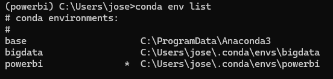
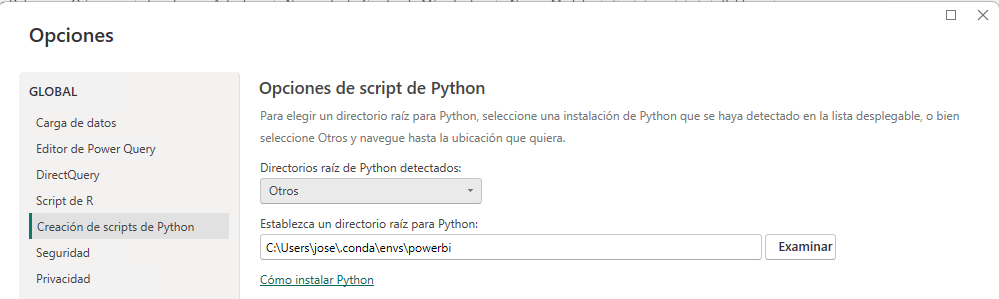

# 📶 PowerBi e Python


## Crear un novo contorno de conda para Microsoft PowerBi

``` bash
conda create -n powerbi python=3.11
conda activate powerbi
conda install -c conda-forge matplotlib pandas mkl-service
```

## Configurar un contorno conda en Microsoft PowerBI

  - Averiguar cal é o directorio do contorno *"powerbi"*, por exemplo con comando:

``` bash
conda env list
```



  - Ir a: *"Archivo -> Opciones y configuración -> Opciones"*.
  - Imos na parte esquerda, en: *"Creación de scripts de Python"*
  - En *"Directorios raíz de Python detectados:"* seleccionamos *"Otros"* e nos aparecerá unha caixa para seleccionar un directorio cunha instalación de Python.
  - En *"Establezca un directorio raíz para Python"* preme en *"Examinar"* e selecciona o cartafol do contorno de conda que temos averiguado anteriormente.



## Empregar código en Python como orixe de datos

  - Facer click en *"Inicio -> Obtener datos -> Más..."*
  - Buscar: *"Script de Python"*.
  - Podes empregar este código como exemplo:

``` py
import pandas as pd
datos_estudantes = ({
    'Nomes':["Fulano", "Mengana", "Zutano", "Perengana"],
    'Pesos' :[83, 56, 90, 60],
    'Notas':[9, 8, 7, 6]
        })
df = pd.DataFrame(datos_estudantes)
```

## Se falla con ADO.net: Python Script Error

Por erros de codificación pode dar unha mesaxe tipo: "ADO.NET: ÞУŧћøñ ŝ¢ѓĭρť έřґσŕ. <pi></pi>". É dicir: ADO.NET: Python Script Error.

Non está a detectar o contorno conda, polo que abriremos unha consola de "Anaconda Powershell" e activamos o contorno de PowerBI:

```
conda activate powerbi
```

Por último arrancamos PowerBI dende esa consola:

```
& 'C:\Program Files\Microsoft Power BI Desktop\bin\PBIDesktop.exe'
```

## Exemplos para importar

Proba a importar a seguinte táboa con PowerBI. Ten en conta que debes transformar as datas antes de aceptar os datos. Despois trata de xogar cos formatos de números para poñer 2 decimais sempre nas columnas de peso e cuota e indica que a columna cuota está en euros.

[Exemplo de táboa de datos para importar](/bigdata/presentacions/selenium/lista-personas.html)

## Obxecto visual de Python

Lembra que se queres empregar os sinónimos "cuasi" estándar das librerías, debes importalas. Por exemplo:

```
import matplotlib.pyplot as plt
dataset.hist(bins=50, figsize=(20,15))
plt.show()
```

## Acceso dende PowerBi a Hadoop

Podes acceder aos arquivos que estean no HDFS dende PowerBI 

Ver tódolos arquivos:

<http://X.Y.Z.T:9870/webhdfs/v1/user?op=LISTSTATUS>

Descargar un arquivo concreto:

<http://hadoop1:9864/webhdfs/v1/user/oteusuario/arquivo.extension?op=OPEN&namenoderpcaddress=hadoop1:9000&offset=0>


Cambiar C:\Windows\system32\drivers\etc\hosts e meter a IP do master co nome:

``` title="C:\Windows\system32\drivers\etc\hosts"
10.133.28.88 hadoop1
```

Isto é necesario porque internamente, cando baixamos un arquivo, por defecto temos configurado que vaia ao nome.


Tamén pode resultarche interesante:

  - **Expresións DAX**: <https://learn.microsoft.com/es-es/dax/>
  - **WebHDFS**: <https://hadoop.apache.org/docs/r1.0.4/webhdfs.html>


