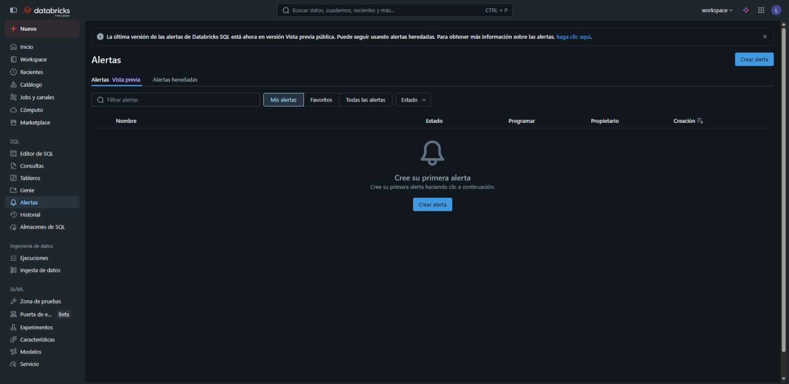
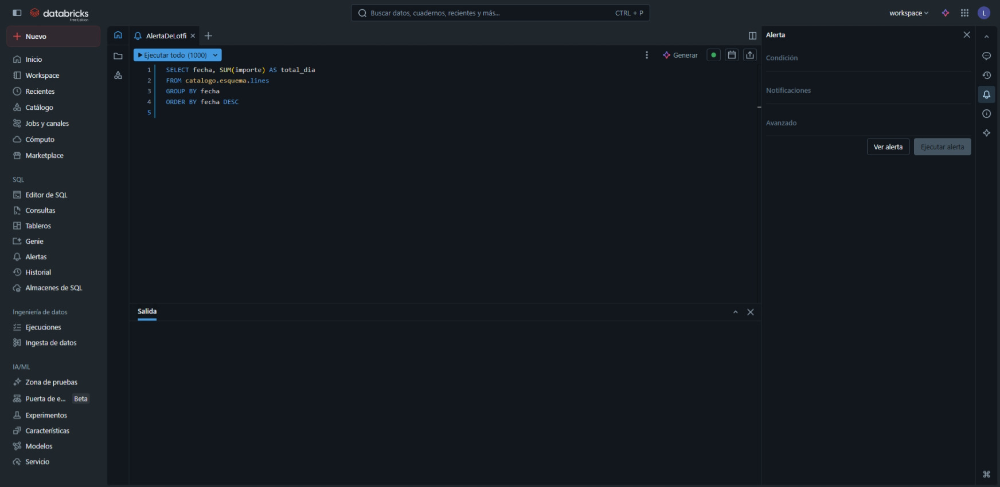
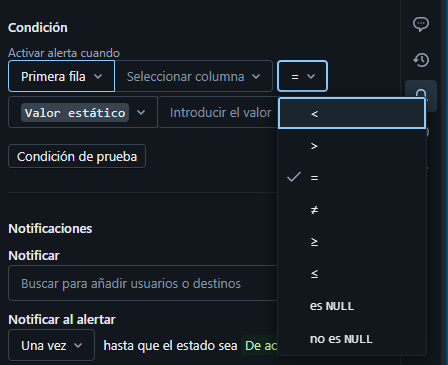
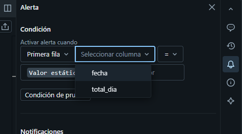
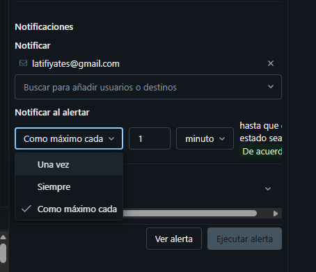
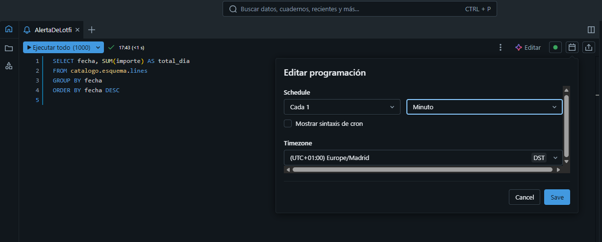
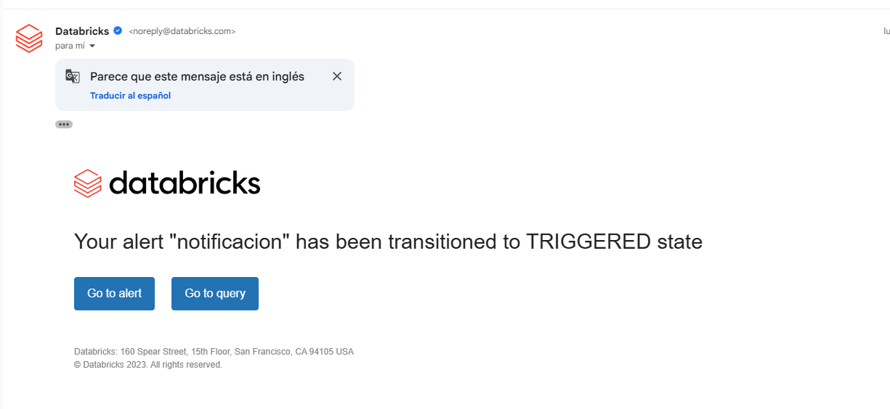
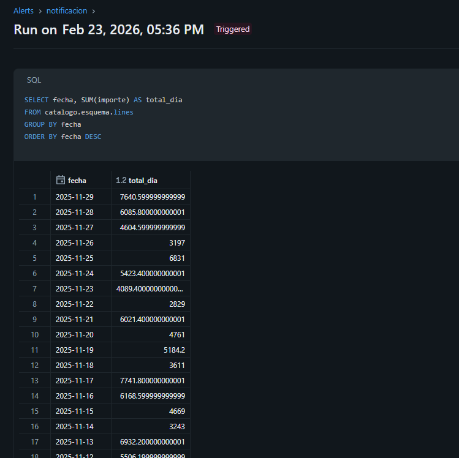

#  Creación de Alertas en Databricks

Este tutorial te guiará a través del proceso de creación de alertas en Databricks para monitorear tus datos y recibir notificaciones cuando se cumplan ciertas condiciones.

##  Pasos para crear una alerta

1.  **Navegar a la sección de Alertas**

    Para comenzar, dirígete a la sección de **SQL** en el menú lateral y selecciona la opción **Alerts** (Alertas).

2.  **Crear la consulta**

    Haz clic en el botón para crear una nueva alerta. A continuación, define la consulta SQL que recuperará los datos que deseas monitorear. Una vez escrita, ejecuta la consulta para verificar que devuelve los resultados esperados.

3.  **Especificar la condición de la alerta**

    Especifica la condición que disparará la alerta basándote en los resultados de tu consulta. Por ejemplo, puedes configurar la alerta para que se active cuando el valor de una columna específica supere un umbral determinado.

4.  **Configurar el destino de la notificación**

    Introduce la dirección de correo electrónico que recibirá la alerta.
    > **Nota:** Solo funcionará con correos electrónicos que estén vinculados al *workspace* donde se está ejecutando la tarea.

5.  **Establecer la frecuencia de actualización**

    Establece la frecuencia con la que Databricks debe volver a ejecutar la consulta para verificar la condición. Finalmente, guarda y activa la alerta.

6.  **Verificar la notificación**

    Una vez que la condición de la alerta se cumpla, recibirás una notificación por correo electrónico como la que se muestra a continuación.

