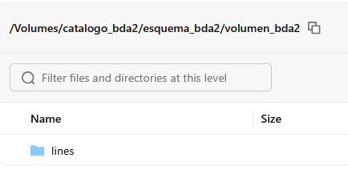
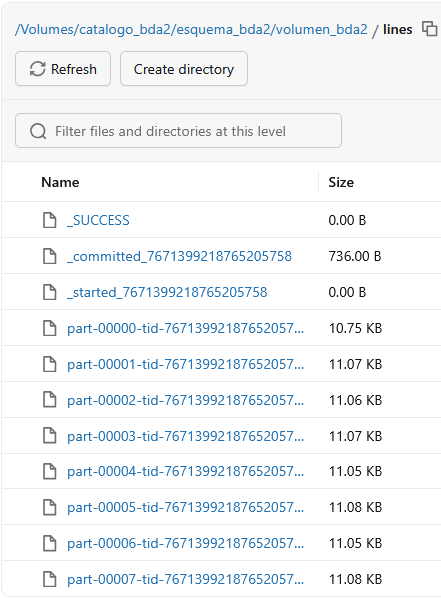
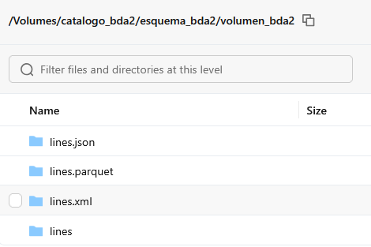
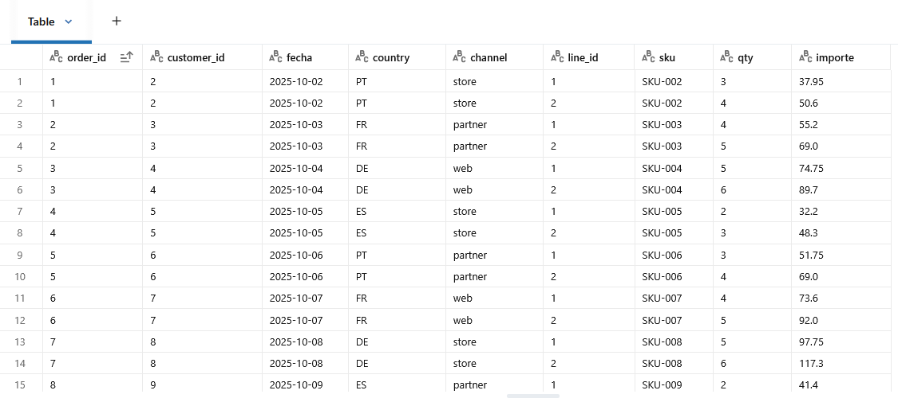
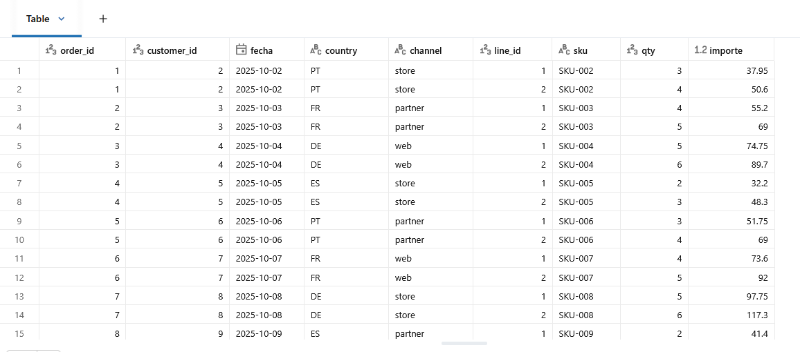

# Meter y sacar datos de un volumen.

## Crear catalogo, esquema y volumen
```
dbutils.widgets.text("catalogo","catalogo_BDA2")

dbutils.widgets.text("esquema","esquema_BDA2")

dbutils.widgets.text("volumen","volumen_BDA2")

CATALOGO = dbutils.widgets.get("catalogo")

ESQUEMA = dbutils.widgets.get("esquema")

VOLUMEN = dbutils.widgets.get("volumen")

spark.sql(f"CREATE CATALOG IF NOT EXISTS {CATALOGO}")

spark.sql(f"CREATE SCHEMA IF NOT EXISTS {CATALOGO}.{ESQUEMA} ")

spark.sql(f"USE {CATALOGO}.{ESQUEMA} ")

spark.sql(f"CREATE VOLUME IF NOT EXISTS {VOLUMEN}")
```
## Crear un dataframe
```
from pyspark.sql import functions as F

base = (spark.range(1, 1000)
    .withColumnRenamed('id', 'order_id')
    .withColumn('customer_id', (F.col('order_id') % 120 + 1).cast('int'))
    .withColumn('fecha', F.date_add(F.to_date(F.lit('2025-10-01')), (F.col('order_id') % 60).cast('int')))
    .withColumn('country', F.when((F.col('order_id') % 4)==0, 'ES')
                        .when((F.col('order_id') % 4)==1, 'PT')
                        .when((F.col('order_id') % 4)==2, 'FR')
                        .otherwise('DE'))
    .withColumn('channel', F.when((F.col('order_id') % 3)==0, 'web')
                        .when((F.col('order_id') % 3)==1, 'store')
                        .otherwise('partner'))
    )
print(type(base))
lines = (base
        .withColumn('line_id', F.explode(F.array([F.lit(1), F.lit(2)])))
        .withColumn('sku', F.concat(F.lit('SKU-'), F.lpad((F.col('order_id') % 80 + 1).cast('string'), 3, '0')))
        .withColumn('qty', (F.col('line_id') + (F.col('order_id') % 4) + 1).cast('int'))
        .withColumn('importe', (F.round((F.col('qty') * (F.col('order_id') % 50 + 10)) * 1.15, 2)).cast('double')))
```

## Guardar dataframe en un CSV

Ahora guardaremos el segundo dataframe como un csv en el volumen. Es importante añadirle "/Volumes/" al principio de la ruta, ya que si no fallará.

```
lines.write.mode("overwrite").option("header", "true").csv(f"/Volumes/{CATALOGO}/{ESQUEMA}/{VOLUMEN}/lines")
```




Podemos ver que se han introducido correctamente los datos

### Otros formatos

#### Parquet
```
lines.write.mode("overwrite").parquet(f"/Volumes/{CATALOGO}/{ESQUEMA}/{VOLUMEN}/lines.parquet")
```
#### JSON
```
lines.write.mode("overwrite").json(f"/Volumes/{CATALOGO}/{ESQUEMA}/{VOLUMEN}/lines.json")
```
#### XML
```
lines.write.mode("overwrite").option("rowTag","line").xml(f"/Volumes/{CATALOGO}/{ESQUEMA}/{VOLUMEN}/lines.xml")
```



## Sacar los datos del volumen
Sacaremos el csv que acabamos de guardar como otro dataframe

```
lines2 = spark.read.csv(f"/Volumes/{CATALOGO}/{ESQUEMA}/{VOLUMEN}/lines", header=True)
```
Y comprobamos si se ha leido correctamente
```
display(lines2)
```


Lo comprobaremos con el dataframe original

```
display(lines1)
```



### Otros formatos

#### Parquet
```
lines3 = spark.read.parquet(f"/Volumes/{CATALOGO}/{ESQUEMA}/{VOLUMEN}/lines.parquet", header=True)
```
#### JSON
```
lines4 = spark.read.json(f"/Volumes/{CATALOGO}/{ESQUEMA}/{VOLUMEN}/lines.json")
```
#### XML
```
lines5 = spark.read.xml(f"/Volumes/{CATALOGO}/{ESQUEMA}/{VOLUMEN}/lines.xml", rowTag="line")
```